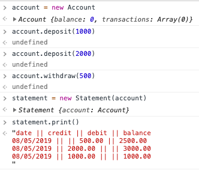

### Bank Tech Test

#### Requirements

- You should be able to interact with your code via a REPL like IRB or the JavaScript console. (You don't need to implement a command line interface that takes input from STDIN.)
- Deposits, withdrawal.
- Account statement (date, amount, balance) printing.
- Data can be kept in memory (it doesn't need to be stored to a database or anything).

#### Acceptance criteria

- Given a client makes a deposit of 1000 on 10-01-2012
- And a deposit of 2000 on 13-01-2012
- And a withdrawal of 500 on 14-01-2012
- When she prints her bank statement
- Then she would see

```
date       || credit  || debit  || balance

14/01/2012 ||         || 500.00 || 2500.00
13/01/2012 || 2000.00 ||        || 3000.00
10/01/2012 || 1000.00 ||        || 1000.00

```

##### Setup
```
- clone repository onto local computer
- run SpecRunner.html file on Chrome by pasting the full path in the browser to check the tests are passing
```
#### Example
```
- open Javascript Console in Chrome and you can try the following example:

account = new Account;
account.deposit(1000);
account.deposit(2000);
account.withdraw(500);

statement = new Statement(account);
statement.print();
```

Picture of the output:



##### Approach

| Account | |
| --- | --- |
| deposit | increases the balance |
| withdrawal | decreases the balance |
| currentBalance | returns current balance from transactions |
| returnTransactions | returns transactions made |
| getFormattedDate | formats the date to view as in the criteria |

| Statement(account) | |
| --- | --- |
| print | prints transaction details from account as in the criteria |
